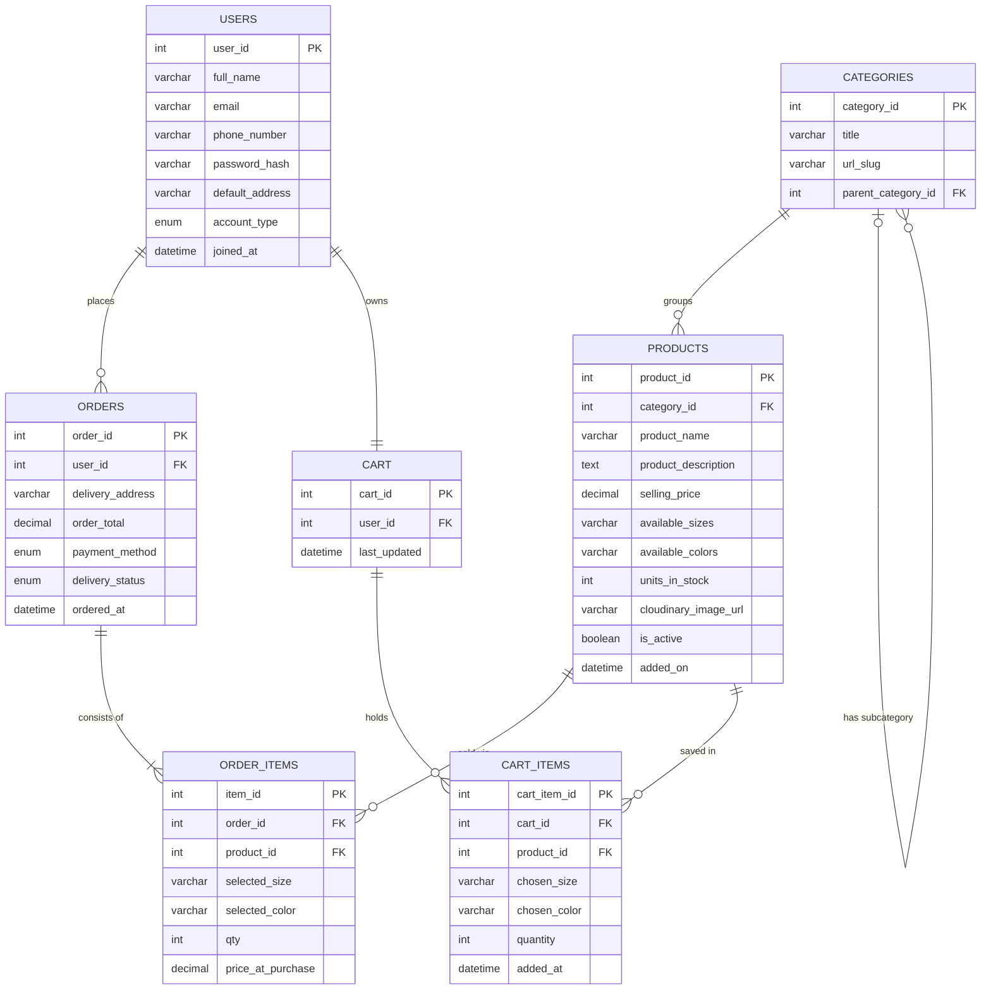

# Sprint 1 — Planning & Architecture Definition
### E-Commerce Web Application | SDLC Assignment

---

## 1. Target Audience & Market Focus

### User Persona

The target users for this platform are **homemakers, working women, and small business owners between the ages of 25 and 50** who purchase clothing, fabric, and accessories regularly but prefer not to visit crowded markets. Many of these users live in semi-urban or suburban areas where good fashion options are limited and travel to commercial markets is inconvenient.

A typical user could be a working woman in her 30s who wants to browse kurtas and lawn suits during lunch breaks on her phone, compare prices, and get delivery at home within 3 to 5 days. She is not necessarily very tech-savvy but is comfortable using WhatsApp and basic apps.

### Core Problem Being Solved

The fashion retail space in Pakistan has a serious gap — physical stores are overcrowded and stock changes rapidly, while most brand websites are either too slow, poorly designed for mobile, or require you to call and confirm your order manually. There is a clear need for a dedicated fashion e-commerce platform that works smoothly on mobile, shows live stock availability, and provides a reliable self-service checkout experience without needing to contact any human.

### Market Vertical

This application targets the **fashion and apparel retail** vertical — specifically women's clothing, fabrics, and accessories. The initial scope will cover a single-brand catalog (one admin adding their own products), and the platform will be built mobile-first since over 80% of the target audience shops from a smartphone.

---

## 2. MVP Feature Scope

The table below lists the 6 features chosen for the MVP phase. Each feature was picked because it directly addresses a pain point of the target user.

| # | Category | Feature | Description | Priority |
|---|----------|---------|-------------|----------|
| 1 | Authentication | User Signup & Login | New users register using phone number or email. Returning users log in and maintain an active session using tokens. | High |
| 2 | Product Catalog | Product Listing with Filters | Display all available clothing items with filters for size, color, and category. Each product shows name, image, price, and available stock. | High |
| 3 | Cart System | Persistent Shopping Cart | Registered users can add items to cart with size/color selection, adjust quantities, and remove items. Cart data is saved between sessions. | High |
| 4 | Checkout & Orders | Order Placement & Confirmation | Users fill in shipping details and place an order. A confirmation screen and email are shown after successful placement. | High |
| 5 | Order Tracking | View Order History & Status | Users can view past orders and check the current delivery status (Pending, Confirmed, Shipped, Delivered). | Medium |
| 6 | Admin Dashboard | Inventory & Order Management | Admin can upload new products with images, manage stock levels, and update delivery statuses for customer orders. | Medium |

---

## 3. Tech Stack Selection & Justification

Each tool in this stack was selected with one guiding principle: get a working product live as fast as possible without sacrificing reliability or maintainability.

### Frontend — Vue.js (with Nuxt.js)

**Justification:** Vue.js was chosen over React for this project because its learning curve is gentler, the template syntax is more readable, and Nuxt.js (built on top of Vue) provides built-in Server-Side Rendering (SSR) out of the box. SSR is especially beneficial for an e-commerce site because product pages load faster and are indexable by search engines — important for organic traffic from Google. Vuetify will be used as the UI component library to quickly build a professional-looking mobile-first interface.

### Backend — Django (Python) with Django REST Framework

**Justification:** Django is a batteries-included framework — it comes with a built-in admin panel, ORM, authentication system, and form handling. This dramatically reduces the amount of code that needs to be written from scratch. Django REST Framework (DRF) makes it straightforward to expose RESTful API endpoints for the Vue frontend to consume. Python was also preferred because it is already known from previous coursework.

### Database — MySQL

**Justification:** MySQL is a proven, widely-used relational database that handles structured transactional data very reliably. Since this application deals with orders, inventory, and user accounts — all of which require strict data consistency — a relational database is the natural choice. MySQL is also very well supported on shared hosting providers like cPanel, which may be used for deployment. Django's ORM abstracts most of the SQL interaction, so writing raw queries will be minimal.

### Optional — Cloudinary (Image Storage)

**Justification:** Product images will be uploaded to Cloudinary rather than stored on the server filesystem. This keeps the backend stateless, prevents storage issues on shared hosting, and Cloudinary provides automatic image optimization and resizing which improves page load speed for product listings.

---

## 4. Entity-Relationship Diagram (ERD)

The ERD below defines the full database schema for this application. All seven required entities are included with their attributes, primary keys, foreign keys, and relationship cardinalities.

### Schema Notes

- **`USERS.account_type`** holds either `customer` or `admin`. Only admin accounts can access the management dashboard.
- **`CATEGORIES.parent_category_id`** is a self-referencing FK that allows subcategories (e.g. "Lawn" under "Summer Collection"). This is optional depth-1 nesting only.
- **`PRODUCTS.available_sizes`** and **`available_colors`** are stored as comma-separated strings for MVP simplicity. A proper variant table would be added in a later sprint.
- **`ORDER_ITEMS.price_at_purchase`** captures the selling price at the moment of order so that future price changes do not alter historical records.
- **`ORDERS.payment_method`** supports `COD` (Cash on Delivery) and `Online` for now. COD is the dominant payment method for the target audience.
- **`ORDERS.delivery_status`** cycles through: `Pending` → `Confirmed` → `Dispatched` → `Delivered`.

---

*Prepared for: Software Engineering / SDLC Course — Sprint 1 Submission*
*Sprint Focus: Planning & Architecture Definition*